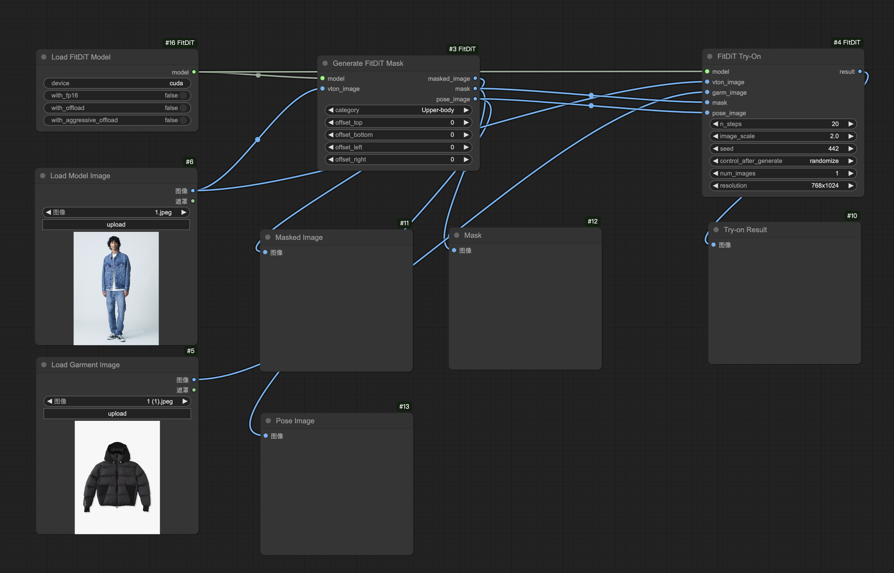

# FitDiT: Advancing the Authentic Garment Details for High-fidelity Virtual Try-on

<div style="display: flex; justify-content: center; align-items: center;">
  <a href="https://arxiv.org/abs/2411.10499" style="margin: 0 2px;">
    
  </a>
  <a href="https://github.com/BoyuanJiang/FitDiT" style="margin: 0 2px;">
    
  </a>
  <a href="https://huggingface.co/spaces/BoyuanJiang/FitDiT" style="margin: 0 2px;">
    
  </a>
  <a href="http://demo.fitdit.byjiang.com/" style="margin: 0 2px;">
    
  </a>
  <a href='https://huggingface.co/BoyuanJiang/FitDiT' style="margin: 0 2px;">
    
  </a>
  <a href='https://byjiang.com/FitDiT/' style="margin: 0 2px;">
    
  </a>
  <a href="https://raw.githubusercontent.com/BoyuanJiang/FitDiT/refs/heads/main/LICENSE" style="margin: 0 2px;">
    
  </a>
</div>

**FitDiT** is designed for high-fidelity virtual try-on using Diffusion Transformers (DiT).
<div align="center">
  
</div>


## Updates
- **`2025/1/16`**: We provide the ComfyUI version of FitDiT, you can use FitDiT in ComfyUI now.


## Installation
Download or clone the repo of [FitDiT-ComfyUI branch](https://github.com/BoyuanJiang/FitDiT/tree/FitDiT-ComfyUI) and place it in the `ComfyUI/custom_nodes/` directory, you can follow the following steps:

1. goto `ComfyUI/custom_nodes` dir in terminal(cmd)
2. `git clone https://github.com/BoyuanJiang/FitDiT.git -b FitDiT-ComfyUI FitDiT`
3. Restart ComfyUI


## Download model
Download the [**FitDiT model**](https://huggingface.co/BoyuanJiang/FitDiT) and place it in the `ComfyUI/models/FitDiT_models` directory, the  [**clip-vit-large-patch14**](https://huggingface.co/openai/clip-vit-large-patch14) and [**CLIP-ViT-bigG-14**](https://huggingface.co/laion/CLIP-ViT-bigG-14-laion2B-39B-b160k) and place them in the `ComfyUI/models/clip` directory.

You can download the model with the following command:
```
pip install -U huggingface_hub
python download_model.py --dir /path/to/ComfyUI/
```

## Example workflows
[fitdit_workflow.json](fitdit_workflow.json) is the example workflow of FitDiT in ComfyUI. If you have less GPU memory, you can set `with_offload` or `with_aggressive_offload` to True.



## Star History

[](https://star-history.com/#BoyuanJiang/FitDiT&Date)

## Contact
This model can only be used **for non-commercial use**. For commercial use, please visit [Tencent Cloud](https://cloud.tencent.com/document/product/1668/108532) for support.


## Citation
If you find our work helpful for your research, please consider citing our work.
```
@misc{jiang2024fitditadvancingauthenticgarment,
      title={FitDiT: Advancing the Authentic Garment Details for High-fidelity Virtual Try-on}, 
      author={Boyuan Jiang and Xiaobin Hu and Donghao Luo and Qingdong He and Chengming Xu and Jinlong Peng and Jiangning Zhang and Chengjie Wang and Yunsheng Wu and Yanwei Fu},
      year={2024},
      eprint={2411.10499},
      archivePrefix={arXiv},
      primaryClass={cs.CV},
      url={https://arxiv.org/abs/2411.10499}, 
}
```

